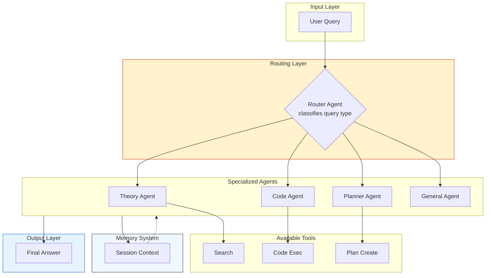

# Study Assistant System Architecture

## Overview

Study Assistant is a multi-agent system built using **LangChain** and **LangGraph**. It follows the **Router + Specialized Agents** pattern: a central router classifies the user query and delegates it to one of four specialized agents. The workflow is implemented as a stateful graph in LangGraph with conditional routing.

## Agents and Responsibilities

The system contains **5 agents**:

| Agent              | Responsibility                                                                 | Tools Used                          |
|--------------------|--------------------------------------------------------------------------------|-------------------------------------|
| **Router Agent**   | Classifies the query into one of four categories: `theory`, `code`, `planning`, `general`. Returns only the category name. | None                                |
| **Theory Agent**   | Explains theoretical concepts in programming, algorithms, data structures, and machine learning. Provides structured, detailed answers. | `search_knowledge_base` (conditionally) |
| **Code Agent**     | Writes complete, commented Python code, explains logic, follows PEP 8, and tests the code. | `execute_python_code` (conditionally) |
| **Planner Agent**  | Creates realistic study plans based on duration and topic. Breaks goals into daily tasks. | `create_study_plan` (conditionally) |
| **General Agent**  | Handles greetings, system information, and general questions. | None                                |

## Multi-Agent Pattern

Implemented pattern: **Router + Specialized Agents**  
- The router acts as the entry point.
- After classification, control is handed off (`handoff`) to the appropriate specialized agent via conditional edges in LangGraph.
- Each specialized agent processes the query independently and returns the final answer.
- No cycles or iterative interaction between agents — linear flow for simplicity and reliability.

## Workflow Diagram (LangGraph)

### Handoff mechanism:
After the router_node determines the category, LangGraph uses conditional_edges to route the state to the corresponding agent node (theory_node, code_node, etc.). Each agent node ends with an edge to END.

## Tool Calling
Tools are invoked conditionally inside agent nodes:
- Theory Agent -> calls search_knowledge_base if keywords like "what is", "explain", "definition" are detected.
- Code Agent -> extracts and executes code blocks using execute_python_code if a code snippet is present in the response.
- Planner Agent -> calls create_study_plan if the query contains planning-related keywords and a number of days.

Tools are defined with the @tool decorator and integrated via direct invocation in the node functions.

## Memory Management

- Component: SessionMemorySystem (in-memory storage)
- Stored data:
  - List of recent interactions (max 20)
  - Timestamp, query, response preview, agent, category, tools used
  - User profile: topics discussed, interaction count
- Usage:
  - Before processing, each specialized agent receives context from the last 2 interactions via memory.get_context(n=2).
  - After processing, memory.add_interaction() updates the history.
-Impact: Enables context-aware responses and session statistics.

## Graph State (AgentState)
Defined as a TypedDict containing:
- messages, query, category, final_answer
- current_agent, agent_history, tools_used
- execution_time

The state is passed through all nodes and updated progressively.
